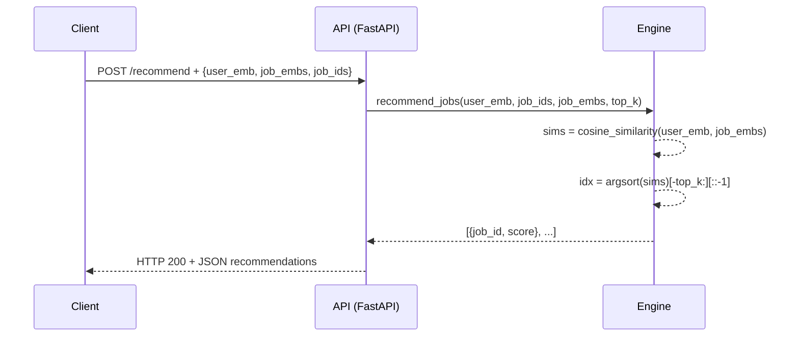

# Recommendation Pipeline

This document details the end-to-end flow, data stores, algorithms, and error handling for generating job recommendations.

---

## 1. End-to-End Request Flow

```plaintext
Client           → FastAPI `/recommend`        → Recommendation Engine       → Response
----------------------------------------------------------------------------------------------
1. Send JSON:   |                         |                                 |
   {
     user_embedding: [...],
     job_ids: [...],
     job_embeddings: [[...],...],
     top_k: N
   }
2. Validate    | Pydantic model          |                                 |
3. Compute     | → cosine_similarity(...) → argsort → select top_k  
4. Return      | JSON [{job_id, score}, ...]    |
```

---

## 2. Data Stores & Schemas

* **Job Embeddings Vector Store** (e.g. FAISS, Milvus)

  ```json
  {
    "job_id": int,
    "embedding": [float,...]
  }
  ```

* **User Embeddings Cache** (Redis)

  ```json
  {
    "user_id": int,
    "embedding": [float,...]
  }
  ```

* **Optional**: Metadata database (PostgreSQL) for job metadata and user profiles.

---

## 3. Nearest-Neighbors Sequence Diagram



---

## 4. Error Handling & Fallback Logic

| Scenario                    | Behavior                                    |
| --------------------------- | ------------------------------------------- |
| Missing or Invalid Payload  | FastAPI returns 422 Unprocessable Entity    |
| Empty `job_embeddings` list | 204 No Content or `{ recommendations: [] }` |
| `top_k` > available jobs    | Return all jobs sorted by score             |
| Non-normalized embeddings   | Normalize on-the-fly before computing sims  |
| Internal Exception          | 500 Internal Server Error + `{error: msg}`  |

---

## 5. Pseudocode

```python
def recommend_jobs(user_emb, job_ids, job_embs, top_k=7):
    # Ensure shapes and normalization
    user_vec = normalize(user_emb)
    job_vecs = normalize(job_embs)

    # Compute similarity scores
    sims = cosine_similarity(user_vec.reshape(1,-1), job_vecs)[0]

    # Get indices of top_k highest scores
    top_indices = np.argsort(sims)[-top_k:][::-1]

    # Build result list
    results = []
    for i in top_indices:
        results.append({
            'job_id': job_ids[i],
            'score': float(sims[i])
        })
    return results

